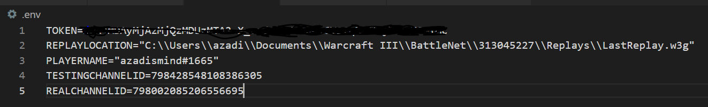

# War3 Replay Bot
This is a Node application that uses chokidar (like fswatch but better) to monitor the LastReplay.w3g file in your replays folder. Whenever the file is updated (i.e. you just finished a game), the replay is parsed using PBug90's [w3gjs Node-based replay parser](https://github.com/PBug90/w3gjs).

The use case is for individuals or teams who want to keep track of their gaming session via Discord in an automated way. When first launched, it will connect to Discord as a bot, using a bot token. After the replay is parsed, a message will be created which pulls out the players and their APM, as well as game length and winners. We do a lookup against Pad's [stat's checker](http://profile.w3booster.com/). Nobody knows how he gets that data to begin with and include each player's stats in the message. In a session, you'll get messages like this:


## How to Setup
1. Checkout the code
2. npm install
3. Copy .env.tmp to .env
4. Setup your Discord bot https://discordpy.readthedocs.io/en/latest/discord.html. Then, click on "Bot" on the left side of the development portal. Next to the icon, it says "TOKEN", with a link to reveasl the token, and one to copy it. This is the token you will need for your .env file in step 6.
5. Turn on Developer Mode in Discord: Settings > Appearance > Developer Mode (on the bottom)
6. Fill in the .env file. Here's what mine looks like. To get the channel IDs, right click on the channel in Discord and click "Copy ID" (this is what step 5 was for). 
7. For testing, change the ```const testing=0``` to ```const testing=1``` near the top of main.js. This will make it so that the last replay is automatically parsed when you start the program, and sends messages to your test channel.
7. node main.js